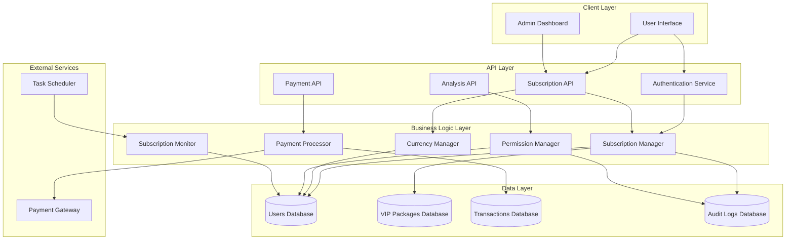

# Design Document: ICT AI Trader Subscription System

## Overview

The ICT AI Trader Subscription System is a comprehensive server-side solution that manages VIP subscription packages, user permissions, automated monitoring, and analysis access control. The system integrates virtual currency management with subscription tiers and provides automated daily monitoring of subscription status.

The architecture follows a layered approach with clear separation between data persistence, business logic, and API layers. All subscription operations are handled server-side to ensure security and data integrity, with automated monitoring processes running daily to maintain subscription validity.

## Architecture

The system follows a three-tier architecture pattern:



## Components and Interfaces

### 1. Database Schema

#### Users Table
```sql
CREATE TABLE users (
    id BIGINT PRIMARY KEY AUTO_INCREMENT,
    username VARCHAR(255) UNIQUE NOT NULL,
    email VARCHAR(255) UNIQUE NOT NULL,
    password_hash VARCHAR(255) NOT NULL,
    subscription_status ENUM('active', 'inactive', 'expired') DEFAULT 'inactive',
    current_package_id BIGINT,
    subscription_start_date DATETIME,
    subscription_end_date DATETIME,
    currency_balance DECIMAL(10,2) DEFAULT 0.00,
    created_at TIMESTAMP DEFAULT CURRENT_TIMESTAMP,
    updated_at TIMESTAMP DEFAULT CURRENT_TIMESTAMP ON UPDATE CURRENT_TIMESTAMP,
    FOREIGN KEY (current_package_id) REFERENCES vip_packages(id)
);
```

#### VIP Packages Table
```sql
CREATE TABLE vip_packages (
    id BIGINT PRIMARY KEY AUTO_INCREMENT,
    package_name VARCHAR(255) NOT NULL,
    duration_type ENUM('weekly', 'monthly', 'annual') NOT NULL,
    duration_value INT NOT NULL,
    price DECIMAL(10,2) NOT NULL,
    currency_allocation DECIMAL(10,2) DEFAULT 0.00,
    has_currency_bonus BOOLEAN DEFAULT FALSE,
    access_type ENUM('unlimited', 'limited') DEFAULT 'unlimited',
    access_limit INT DEFAULT NULL,
    features JSON,
    is_active BOOLEAN DEFAULT TRUE,
    created_at TIMESTAMP DEFAULT CURRENT_TIMESTAMP,
    updated_at TIMESTAMP DEFAULT CURRENT_TIMESTAMP ON UPDATE CURRENT_TIMESTAMP
);
```

#### Transactions Table
```sql
CREATE TABLE subscription_transactions (
    id BIGINT PRIMARY KEY AUTO_INCREMENT,
    user_id BIGINT NOT NULL,
    package_id BIGINT NOT NULL,
    transaction_type ENUM('purchase', 'renewal', 'refund') NOT NULL,
    amount DECIMAL(10,2) NOT NULL,
    payment_method VARCHAR(100),
    payment_gateway_id VARCHAR(255),
    status ENUM('pending', 'completed', 'failed', 'refunded') NOT NULL,
    created_at TIMESTAMP DEFAULT CURRENT_TIMESTAMP,
    FOREIGN KEY (user_id) REFERENCES users(id),
    FOREIGN KEY (package_id) REFERENCES vip_packages(id)
);
```

#### Currency Transactions Table
```sql
CREATE TABLE currency_transactions (
    id BIGINT PRIMARY KEY AUTO_INCREMENT,
    user_id BIGINT NOT NULL,
    transaction_type ENUM('credit', 'debit', 'bonus') NOT NULL,
    amount DECIMAL(10,2) NOT NULL,
    balance_after DECIMAL(10,2) NOT NULL,
    description VARCHAR(500),
    reference_id BIGINT,
    created_at TIMESTAMP DEFAULT CURRENT_TIMESTAMP,
    FOREIGN KEY (user_id) REFERENCES users(id)
);
```

### 2. Core Services

#### Subscription Manager
```typescript
interface ISubscriptionManager {
    createSubscription(userId: number, packageId: number): Promise<SubscriptionResult>;
    renewSubscription(userId: number, packageId: number): Promise<SubscriptionResult>;
    cancelSubscription(userId: number): Promise<boolean>;
    getSubscriptionStatus(userId: number): Promise<SubscriptionStatus>;
    upgradeSubscription(userId: number, newPackageId: number): Promise<SubscriptionResult>;
    validateSubscription(userId: number): Promise<ValidationResult>;
}

interface SubscriptionResult {
    success: boolean;
    subscriptionId?: number;
    expirationDate?: Date;
    error?: string;
}

interface SubscriptionStatus {
    isActive: boolean;
    packageName: string;
    expirationDate: Date;
    currencyBalance: number;
    remainingDays: number;
}
```

#### Permission Manager
```typescript
interface IPermissionManager {
    checkAnalysisPermission(userId: number): Promise<PermissionResult>;
    validateAccess(userId: number, feature: string): Promise<boolean>;
    logAccessAttempt(userId: number, feature: string, granted: boolean): Promise<void>;
}

interface PermissionResult {
    granted: boolean;
    reason?: string;
    subscriptionStatus: SubscriptionStatus;
}
```

#### Currency Manager
```typescript
interface ICurrencyManager {
    creditCurrency(userId: number, amount: number, description: string): Promise<CurrencyResult>;
    debitCurrency(userId: number, amount: number, description: string): Promise<CurrencyResult>;
    getBalance(userId: number): Promise<number>;
    getTransactionHistory(userId: number, limit?: number): Promise<CurrencyTransaction[]>;
}

interface CurrencyResult {
    success: boolean;
    newBalance: number;
    transactionId?: number;
    error?: string;
}
```

### 3. API Endpoints

#### Subscription API
```typescript
// GET /api/subscriptions/status
// POST /api/subscriptions/purchase
// POST /api/subscriptions/renew
// PUT /api/subscriptions/upgrade
// DELETE /api/subscriptions/cancel

// GET /api/packages
// GET /api/packages/:id
// POST /api/packages (admin only)
// PUT /api/packages/:id (admin only)
```

#### Analysis Permission API
```typescript
// POST /api/analysis/validate-access
// GET /api/analysis/permissions/:userId
```

#### Currency API
```typescript
// GET /api/currency/balance
// GET /api/currency/transactions
// POST /api/currency/spend
```

## Data Models

### User Model
```typescript
interface User {
    id: number;
    username: string;
    email: string;
    subscriptionStatus: 'active' | 'inactive' | 'expired';
    currentPackageId?: number;
    subscriptionStartDate?: Date;
    subscriptionEndDate?: Date;
    currencyBalance: number;
    createdAt: Date;
    updatedAt: Date;
}
```

### VIP Package Model
```typescript
interface VIPPackage {
    id: number;
    packageName: string;
    durationType: 'weekly' | 'monthly' | 'annual';
    durationValue: number;
    price: number;
    currencyAllocation: number;
    hasCurrencyBonus: boolean;
    accessType: 'unlimited' | 'limited';
    accessLimit?: number;
    features: PackageFeature[];
    isActive: boolean;
    createdAt: Date;
    updatedAt: Date;
}

interface PackageFeature {
    name: string;
    description: string;
    enabled: boolean;
}
```

### Subscription Transaction Model
```typescript
interface SubscriptionTransaction {
    id: number;
    userId: number;
    packageId: number;
    transactionType: 'purchase' | 'renewal' | 'refund';
    amount: number;
    paymentMethod: string;
    paymentGatewayId: string;
    status: 'pending' | 'completed' | 'failed' | 'refunded';
    createdAt: Date;
}
```

Now I need to use the prework tool to analyze the acceptance criteria before writing the Correctness Properties section.
## Correctness Properties

*A property is a characteristic or behavior that should hold true across all valid executions of a system-essentially, a formal statement about what the system should do. Properties serve as the bridge between human-readable specifications and machine-verifiable correctness guarantees.*

### Property Reflection

After analyzing all acceptance criteria, several properties can be consolidated to eliminate redundancy:

- Properties related to subscription validation (7.1, 7.3) can be combined into a comprehensive validation property
- Currency balance tracking (5.2) and transaction history (5.5) can be combined into a currency consistency property
- Audit logging properties (2.4, 3.5, 6.5, 10.5) can be consolidated into a comprehensive audit property
- Permission checking properties (3.1, 3.2, 3.3, 3.4) can be combined into a unified access control property

### Core Properties

**Property 1: New User Default State**
*For any* new user registration, the user should be created with subscription status set to 'inactive' and currency balance set to 0.00
**Validates: Requirements 1.3**

**Property 2: VIP Package Validation**
*For any* VIP package creation attempt, all required fields (name, duration, price, features) must be validated and invalid packages should be rejected
**Validates: Requirements 1.4**

**Property 3: Referential Integrity**
*For any* user subscription assignment, the assigned package ID must exist in the VIP packages table, and invalid assignments should be rejected
**Validates: Requirements 1.5**

**Property 4: Subscription Validation Consistency**
*For any* subscription validation request, the system should check both expiration date and subscription status using server-side timestamps, and failed validations should be logged
**Validates: Requirements 2.2, 7.1, 7.2, 7.3**

**Property 5: Atomic Subscription Operations**
*For any* subscription operation (purchase, renewal, upgrade), either all related database updates succeed together or all fail together, preventing partial state updates
**Validates: Requirements 2.3**

**Property 6: Analysis Access Control**
*For any* analysis request, access should be granted if and only if the user has an active, non-expired subscription, with all access attempts logged
**Validates: Requirements 3.1, 3.2, 3.3, 3.4, 3.5**

**Property 7: Package Configuration Flexibility**
*For any* VIP package, it should be configurable with any combination of duration type (weekly/monthly/annual), currency allocation (with or without), and access type (unlimited/limited)
**Validates: Requirements 4.2, 4.3**

**Property 8: Immediate Subscription Activation**
*For any* successful VIP package purchase, the subscription should be activated immediately with correct expiration date calculated based on package duration and purchase timestamp
**Validates: Requirements 4.4, 4.5**

**Property 9: Currency Operations Consistency**
*For any* currency operation (credit, debit, bonus), the user's balance should be updated correctly, transaction history should be maintained, and negative balances should be prevented
**Validates: Requirements 5.1, 5.2, 5.3, 5.5**

**Property 10: Currency Balance Accuracy**
*For any* user account, querying the currency balance should return the exact amount calculated from all credit and debit transactions in the transaction history
**Validates: Requirements 5.4**

**Property 11: Expired Subscription Processing**
*For any* subscription that has passed its expiration date, the monitoring system should identify it as expired and update the user status to inactive
**Validates: Requirements 6.2, 6.3**

**Property 12: Expiration Notification Timing**
*For any* subscription expiring within 3 days, the monitoring system should generate appropriate expiration notifications
**Validates: Requirements 6.4**

**Property 13: Rate Limiting Protection**
*For any* sequence of subscription validation requests from the same source exceeding the rate limit, subsequent requests should be rejected until the rate limit window resets
**Validates: Requirements 7.4**

**Property 14: Profile Information Completeness**
*For any* user profile request, the response should include current subscription status, expiration date (if applicable), and current currency balance
**Validates: Requirements 8.1**

**Property 15: Package Listing Completeness**
*For any* VIP package listing request, all active packages should be returned with complete pricing, duration, and feature information
**Validates: Requirements 8.2**

**Property 16: Subscription History Accuracy**
*For any* user's subscription history request, the returned data should include all past purchases, renewals, and upgrades in chronological order
**Validates: Requirements 8.4**

**Property 17: Payment-Subscription Coupling**
*For any* subscription purchase attempt, the subscription should be activated if and only if the payment is successfully processed and confirmed
**Validates: Requirements 9.2, 9.3**

**Property 18: Transaction Receipt Generation**
*For any* successful subscription purchase, a transaction receipt should be generated containing all relevant purchase details
**Validates: Requirements 9.4**

**Property 19: Comprehensive Audit Logging**
*For any* system operation (subscription changes, currency transactions, access attempts, admin actions), an audit log entry should be created with timestamp, user, action, and result
**Validates: Requirements 2.4, 3.5, 6.5, 10.5**

**Property 20: Admin Operation Authority**
*For any* administrative operation (package creation, user status modification, bulk operations), the operation should succeed if and only if performed by an authenticated administrator with appropriate permissions
**Validates: Requirements 10.1, 10.2, 10.4**

## Error Handling

### Subscription Operation Errors

**Payment Processing Failures**
- Payment gateway timeouts: Retry with exponential backoff, maintain pending status
- Invalid payment methods: Return clear error messages, suggest valid alternatives
- Insufficient funds: Provide specific error message, maintain current subscription status
- Payment gateway errors: Log detailed error information, provide user-friendly message

**Database Operation Failures**
- Connection timeouts: Implement connection pooling and retry logic
- Constraint violations: Return specific validation error messages
- Transaction deadlocks: Implement automatic retry with jitter
- Data corruption: Implement data integrity checks and recovery procedures

**Validation Errors**
- Invalid subscription data: Return detailed field-level validation errors
- Expired authentication tokens: Require re-authentication, maintain session state
- Rate limit exceeded: Return 429 status with retry-after header
- Malformed requests: Return 400 status with specific error details

### Currency System Errors

**Balance Operation Failures**
- Insufficient balance: Prevent operation, return current balance information
- Concurrent balance modifications: Use optimistic locking with retry logic
- Currency calculation errors: Implement decimal precision handling
- Transaction log failures: Ensure transaction atomicity with compensation logic

### Monitoring System Errors

**Scheduled Task Failures**
- Monitor execution failures: Implement alerting and manual intervention procedures
- Database unavailability during monitoring: Queue operations for retry
- Notification delivery failures: Implement retry logic with multiple delivery channels
- Bulk operation timeouts: Implement chunked processing with progress tracking

### Recovery Procedures

**Data Consistency Recovery**
- Implement database transaction logs for point-in-time recovery
- Provide manual tools for subscription status correction
- Maintain backup procedures for critical subscription data
- Implement data validation checks during system startup

**Service Availability Recovery**
- Implement health checks for all critical services
- Provide graceful degradation for non-critical features
- Implement circuit breaker patterns for external service calls
- Maintain service dependency mapping for failure isolation

## Testing Strategy

### Dual Testing Approach

The testing strategy employs both unit testing and property-based testing as complementary approaches:

**Unit Tests**: Focus on specific examples, edge cases, and error conditions
- Test specific subscription scenarios (weekly, monthly, annual packages)
- Test edge cases like subscription expiration boundary conditions
- Test error conditions like payment failures and invalid data
- Test integration points between services

**Property Tests**: Verify universal properties across all inputs through randomization
- Test properties with randomly generated users, packages, and transactions
- Verify system behavior across wide input ranges
- Catch edge cases that might be missed in unit tests
- Validate business rules hold under all conditions

### Property-Based Testing Configuration

**Testing Framework**: Use fast-check for TypeScript/JavaScript implementation
- Minimum 100 iterations per property test to ensure comprehensive coverage
- Each property test references its corresponding design document property
- Tag format: **Feature: ict-ai-trader-subscription, Property {number}: {property_text}**

**Test Data Generation**:
- Generate random users with various subscription states
- Generate random VIP packages with different configurations
- Generate random currency amounts and transaction sequences
- Generate random timestamps for expiration testing

**Property Test Examples**:

```typescript
// Property 1: New User Default State
test('Feature: ict-ai-trader-subscription, Property 1: New user default state', () => {
  fc.assert(fc.property(
    fc.record({
      username: fc.string(),
      email: fc.emailAddress(),
      password: fc.string()
    }),
    async (userData) => {
      const user = await createUser(userData);
      expect(user.subscriptionStatus).toBe('inactive');
      expect(user.currencyBalance).toBe(0.00);
    }
  ), { numRuns: 100 });
});

// Property 9: Currency Operations Consistency
test('Feature: ict-ai-trader-subscription, Property 9: Currency operations consistency', () => {
  fc.assert(fc.property(
    fc.integer({ min: 1, max: 1000 }),
    fc.array(fc.record({
      type: fc.constantFrom('credit', 'debit'),
      amount: fc.float({ min: 0.01, max: 100.00 })
    })),
    async (userId, operations) => {
      let expectedBalance = 0;
      for (const op of operations) {
        if (op.type === 'credit') {
          await creditCurrency(userId, op.amount);
          expectedBalance += op.amount;
        } else if (expectedBalance >= op.amount) {
          await debitCurrency(userId, op.amount);
          expectedBalance -= op.amount;
        }
      }
      const actualBalance = await getCurrencyBalance(userId);
      expect(actualBalance).toBeCloseTo(expectedBalance, 2);
    }
  ), { numRuns: 100 });
});
```

### Unit Testing Focus Areas

**Subscription Lifecycle Testing**:
- Test subscription creation with valid and invalid data
- Test subscription renewal and upgrade scenarios
- Test subscription cancellation and expiration handling
- Test subscription validation edge cases

**Currency System Testing**:
- Test currency crediting and debiting operations
- Test negative balance prevention
- Test currency transaction history accuracy
- Test concurrent currency operations

**Permission System Testing**:
- Test analysis access with various subscription states
- Test permission caching and invalidation
- Test rate limiting implementation
- Test audit logging completeness

**Integration Testing**:
- Test payment gateway integration scenarios
- Test database transaction handling
- Test monitoring system execution
- Test admin interface operations

### Test Environment Configuration

**Database Testing**:
- Use in-memory database for unit tests
- Use containerized database for integration tests
- Implement database seeding for consistent test data
- Use database transactions for test isolation

**External Service Mocking**:
- Mock payment gateway responses for various scenarios
- Mock email notification services
- Mock scheduling services for monitoring tests
- Implement configurable delays for timing tests

**Performance Testing**:
- Load test subscription operations under concurrent access
- Test monitoring system performance with large user bases
- Test database query performance with realistic data volumes
- Test API response times under various load conditions